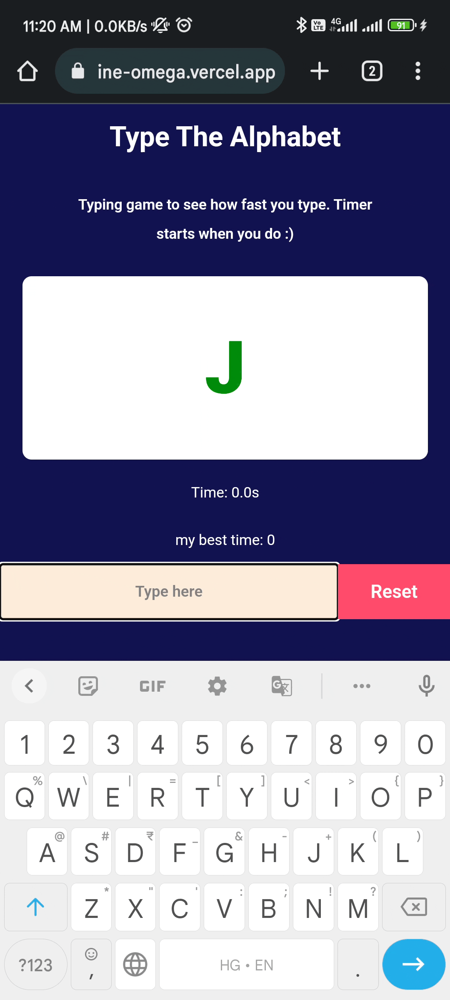

<div align="center">
  

# Type the Alphabet


 </div>

---

## How to run the app locally?

```
$ git clone https://github.com/shivampandey0/typing-game.git
$ cd typing-game
$ npm install
$ npm start
```

---

## Features
- The application is a game which can be played using the keyboard
- At the start of the application, the timer should start at zero seconds
- The application should show random 20 alphabets one at a time
* The alphabet changes once the user enters the same alphabet on the keyboard
- Entering the wrong alphabet should have a penalty of 0.5 second
* The keyboard should be always open
- On completing the 20 alphabets, show success if the high score (time taken to
complete 20 characters) is beaten or shows failure otherwise 
* Persist the high score locally

---

## Tech Stack and Tools

- React JS
- Vercel for Deployment

---

## Live Deployment

Checkout the live deployment here: [TypeTheAlphabet](https://typing-game-nine-omega.vercel.app/)

---

## Demo Video



